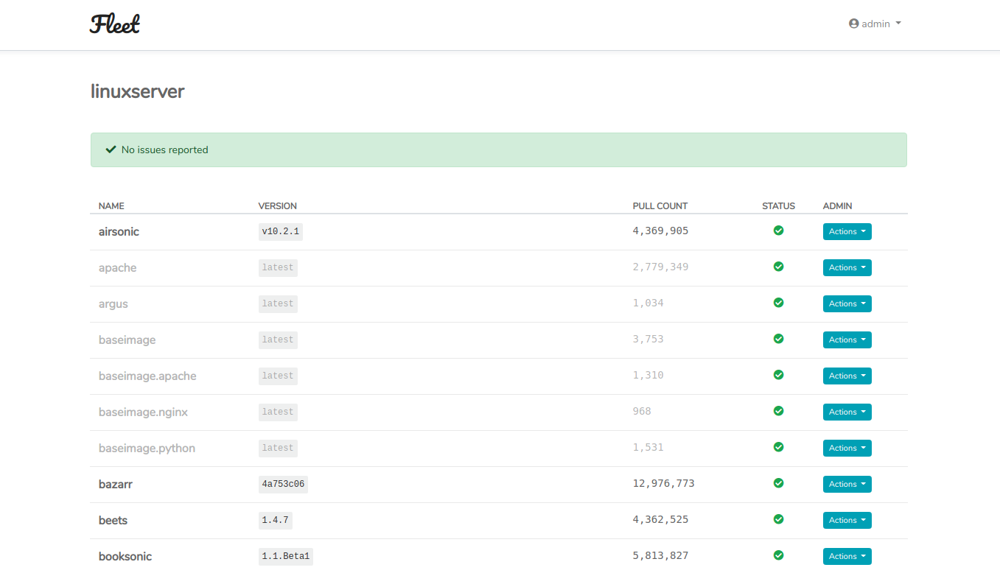

# Fleet

Fleet is a Docker Hub repository and image management tool for organisations (or individuals) who wish to display a list of all currently available images, along with their latest version and build status. The idea for this application was borne out of a necessity for the LinuxServer team to be able to provide a mechanism for its users to see the current build version of the images they use.

Image information is retrieved via the Docker Hub API (v2) through a scheduled task, which runs at a given (configurable) interval. This task will synchronise all repositories owned by the user whose credentials are used to authorise the initial requests to Docker Hub. Fleet will store in memory a valid authorisation token and will reuse it until it expires, after which a new token will be requested.

## Management

For administrators of the application, Fleet provides a way to manage which repositories get synchronised, and how each image's latest versioned tag should be masked.

### Repositories

All repositories for the user are automatically retrieved upon start up, and by default not synchronised. The administration page allows you to toggle which repositories are synchronised (and thus displayed on the main page).

#### Version Mask

Depending on how an image gets built, its versioned tag may contain extraneous information, or wrap the inner application's version with build information. If you wish to represent the image's "version" as the wrapped application's version instead, you can apply a version mask using standard REGEX, which will pull out the specific part of the tag you wish to used for the version. Multiple capture groups are supported, and will be concatenated in match order.

### Images

Each image in a repository is by default shown on the main page, along with their current version and build status (which is a manually set flag). When logged in, users are able to manually configure the visiblity and status of each image:

#### Version Mask

A specific version mask can be applied to an image, which will override the default repository mask (which applies to all images). Useful if a certain image uses different tagging standards.
